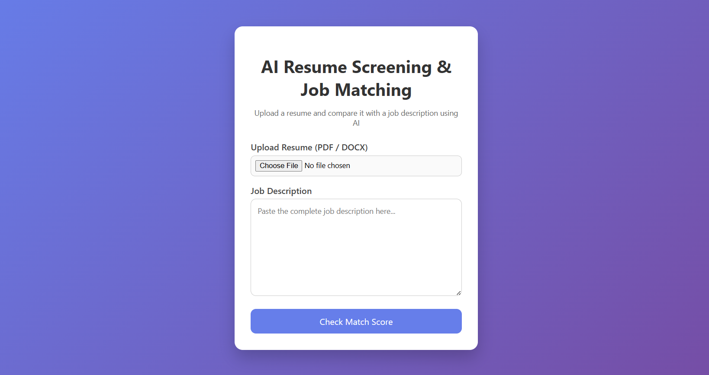
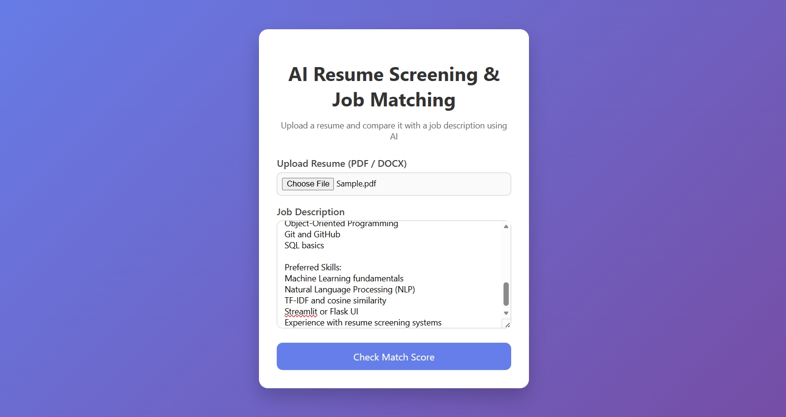
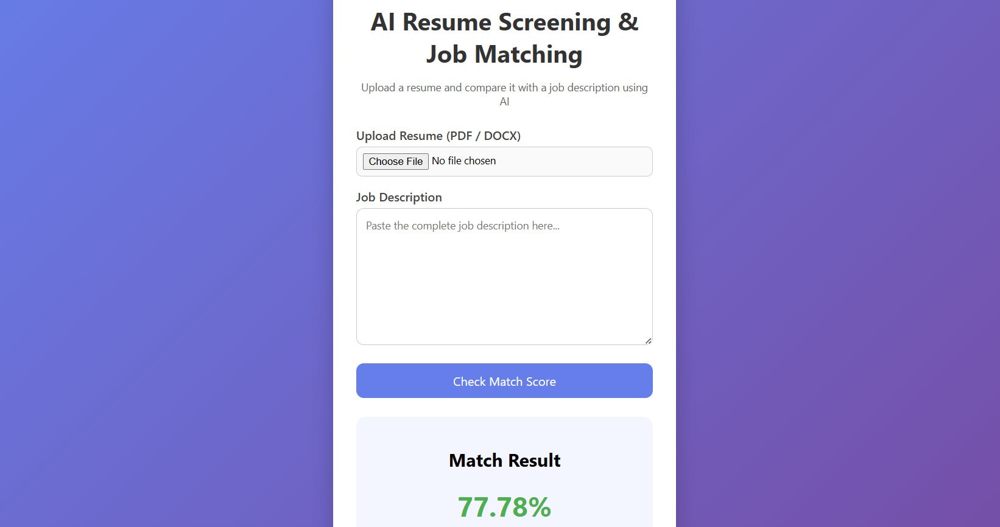

# AI-Based Resume Screening & Job Matching System 

An AI-powered web application that analyzes resumes and job descriptions to determine how well a candidate matches a given role. The system calculates a match percentage and categorizes candidates into **Great, Good, Average, or Poor Match**, similar to real-world Applicant Tracking Systems (ATS).

## Direct Link : https://ai-rsume-screening-system.onrender.com

## Project Overview

Recruiters often spend a significant amount of time manually screening resumes. This project demonstrates how **Artificial Intelligence and Natural Language Processing (NLP)** can be used to automate resume screening and provide meaningful insights to support hiring decisions.

The application accepts resumes in **PDF or DOCX format**, processes the text using NLP techniques, and compares it with a job description using machine learning-based similarity analysis.

## Features

- Upload resumes in **PDF or DOCX** format  
- Input job descriptions directly through the web interface  
- Text preprocessing using **NLP (NLTK)**  
- Resume–job similarity calculation using **TF-IDF & Cosine Similarity**  
- Match percentage output  
- Candidate categorization:
  - **Great Match (≥ 85%)**
  - **Good Match (≥ 70%)**
  - **Average Match (≥ 40%)**
  - **Poor Match (< 40%)**
- Clean and user-friendly web interface  

## Demo

Below is a screenshot of the working application showing resume upload, job description input, and match result.

Screenshot:

### Home Page

### Resume Upload

### Result

## Tech Stack

- **Programming Language:** Python  
- **Backend Framework:** Flask  
- **Machine Learning & NLP:**  
  - NLTK  
  - Scikit-learn (TF-IDF, Cosine Similarity)  
- **Frontend:** HTML, CSS  

## How It Works

1. The user uploads a resume and provides a job description  
2. Resume text is extracted from PDF/DOCX files  
3. NLP techniques clean and normalize the text  
4. Text is converted into numerical features using TF-IDF  
5. Cosine similarity is used to compute the match score  
6. The system displays the match percentage and category  

## Dependencies

All required libraries are listed in `requirements.txt`, including:
- Flask
- nltk
- scikit-learn
- PyPDF2
- python-docx

## Use Cases

- Resume screening for recruiters and HR teams  
- ATS-style candidate shortlisting  
- Resume optimization and job matching analysis  
- Learning project for NLP and ML beginners  

## What I Learned

- Text extraction from PDF and DOCX files  
- Natural Language Processing using NLTK  
- Feature extraction using TF-IDF  
- Similarity measurement with Cosine Similarity  
- Flask backend development  
- Frontend–backend integration  

## Future Improvements

- Skill gap analysis and missing skill detection  
- Resume ranking system for multiple candidates  
- Advanced NLP models (Word2Vec, BERT)  
- Database integration for resume storage  
- Cloud deployment (AWS / Render / Vercel) 

## Limitations

- Matching is based on textual similarity, not semantic understanding  
- Does not currently detect missing or inferred skills  
- Results may vary depending on resume formatting and wording  

## Conclusion

This project demonstrates how AI and NLP can be applied to automate resume screening and job matching. It combines machine learning concepts with real-world web development, offering a practical introduction to building intelligent recruitment tools.
